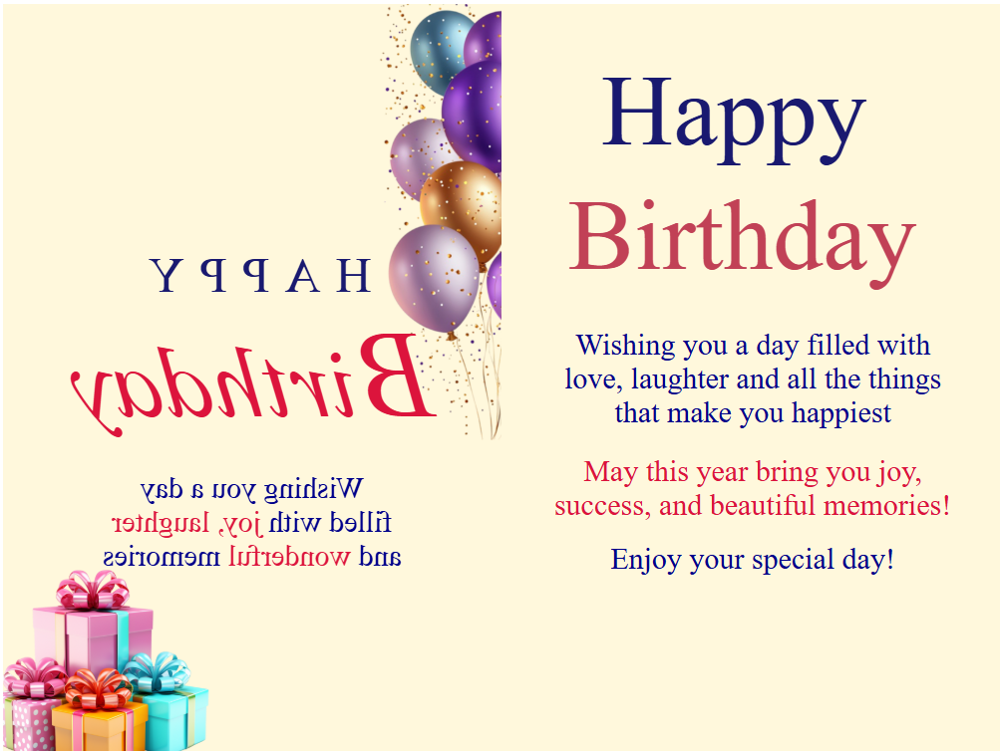

# 🎉 Greeting Card Website

A responsive **Greeting Card Website** developed using **HTML5** and **CSS3** as part of my **Web Technology training at QSpiders**.

The project demonstrates a creative digital greeting card featuring a **3D flip animation**, attractive typography, and a birthday greeting designed using only HTML and CSS.

---

## 📖 Project Information

* **Project Type:** Academic Assignment
* **Institute:** QSpiders
* **Course:** Java Full Stack Development – Web Technologies
* **Technology Used:** HTML5, CSS3
* **Project Status:** Completed

---

## 🌐 Live Demo

🔗 https://vighneshmunde.github.io/Greeting-Card-Website/

---

## 📌 Project Overview

The Greeting Card Website is an interactive web page that displays a beautifully designed birthday greeting card. When the user hovers over the card, it opens using a smooth **3D flip animation**, revealing a personalized birthday message.

---

## ✨ Features

* 🎉 Interactive Greeting Card
* 🎂 Birthday Greeting Design
* 🎁 3D Flip Animation
* 🎈 Decorative Images
* 🎨 Creative Typography
* ✨ Smooth CSS Transitions
* 📱 Responsive Layout

---

## 🛠️ Technologies Used

* HTML5
* CSS3

---

## 📚 HTML Concepts Used

* HTML5 Document Structure
* Headings
* Paragraphs
* Images
* Div Elements
* Text Formatting
* HTML Attributes

---

## 🎨 CSS Concepts Used

* CSS Selectors
* Flexbox
* Box Model
* Margins & Padding
* Typography
* Colors
* CSS Positioning
* CSS Transitions
* CSS Transforms
* 3D Transform (`rotateY`)
* Perspective
* Transform Origin
* Overflow
* Pseudo Element (`::first-letter`)

---

## 🎯 Learning Objectives

This project helped me:

* Understand CSS 3D transformations.
* Create smooth flip animations.
* Improve webpage layout using Flexbox.
* Design attractive user interfaces using HTML and CSS.
* Practice responsive web design concepts.

---

## 📂 Project Structure

```text
Greeting-Card-Website/
│
├── index.html
├── screenshots/
│   ├── 01-front-card.png
│   └── 02-inside-card.png
└── README.md
```

---

## 📸 Screenshots

### Front View


### Inside View



---

## 🚀 Getting Started

### Clone the Repository

```bash
git clone https://github.com/vighneshmunde/Greeting-Card-Website.git
```

### Run the Project

1. Open the project folder.
2. Double-click `index.html`.

OR

Open `index.html` in any modern web browser.

---

## 💻 Browser Compatibility

* Google Chrome
* Microsoft Edge
* Mozilla Firefox
* Opera

---

## 📚 What I Learned

* HTML page structure
* CSS styling
* Flexbox
* CSS transitions
* CSS transforms
* 3D animations
* Interactive UI design

---

## 📌 Future Improvements

* Add background music.
* Make the card mobile responsive.
* Add JavaScript interactions.
* Allow users to customize the greeting.
* Add multiple greeting card themes.

---

## 👨‍💻 Developed By

**Vighnesh Munde**

B.Sc. Computer Science Graduate

Java Full Stack Developer Trainee @ QSpiders

---

## ⭐ Support

If you like this project, don't forget to ⭐ the repository.

---

## 📄 License

This project was created for educational and learning purposes.
